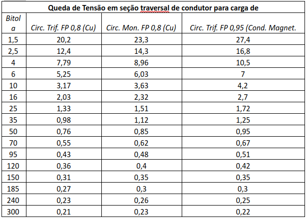
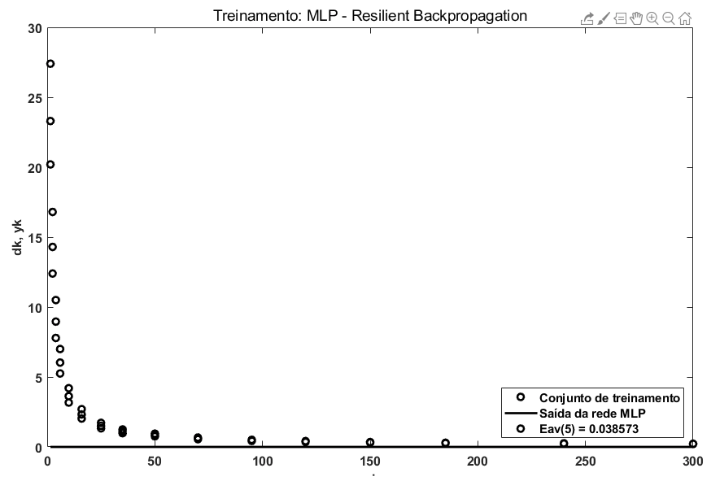
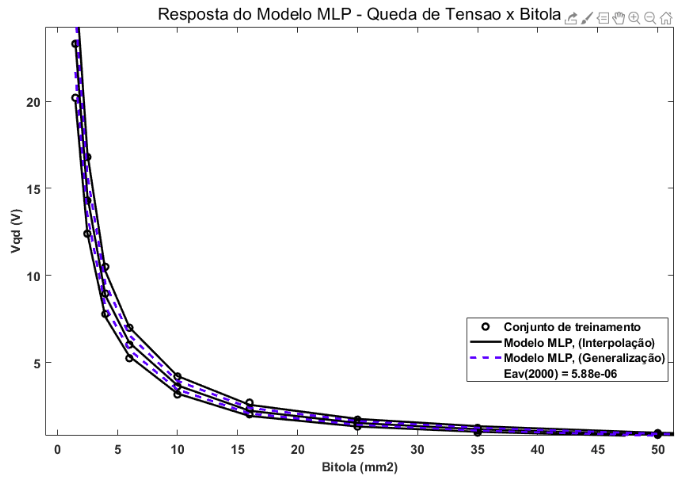

#### 1. Mostre que:

**Resposta:** 

Sabendo que:

e:

  

Pela regra da cadeia, temos:

Portanto deve-se calcular os três termos da regra da cadeia para determinar o que se quer demonstrar.

Calculando o primeiro termo:

Calculando o segundo termo:

Pela equação (1), tem-se:

Calculando o terceiro e último termo, tem-se:

Simplificando a equação acima, obtemos o resultado do terceiro e último termo da regra da cadeia:

Logo, explicitando todos os termos calculados para a regra da cadeia tem-se:

Então, como queríamos demostrar:

#### 2. Estude a convergência de diferentes algoritmos de primeira ordem para aproximação de funções de uma variável (1-D) através de redes FNN.

#### Reposta:

#### 3. Desenvolva uma aplicação de modelagem em 2-D e verifique a propriedade de generalização de uma rede neural sem realimentação.

Para esta tarefa, fui apresentado um gráfico que demonstra a capacidade de generalização de uma rede MLP com algoritmo RPROC, sem realimentação, utilizando dados de um sinal obtidos a partir de um MOSFET. Como ilustra a Figura a seguir.

O desafio propõe a configuração de outra base de dado que ilustre resultado semelhante. 

**Solução proposta:** Foi implementado na rede artificial MLPRPROP o modelo para queda de tensão em três condições diferentes para determinados condutores, os dados estão representados na Tabela a seguir:

Para a inserção dos dados na rede foi necessário as seguintes modificações no código fornecido:
	
	N=16;
	dados = xlsread('path/database.xls');
	vds=dados(1:N);
	ids=dados(N+1:4*N);  

**Resultado:** O gráfico a seguir aparentemente o resultado obtido, é possível observar uma breve separação das curvas, isto ocorre devido a proximidade dos sinais. Na figura a seguir é apresentado o gráfico de treinamento.

Resultado para 2000 épocas (epochmax=2000)

  

#### 4. Desenvolva uma aplicação de classificação de padrões e verifique a propriedade de generalização de uma rede neural sem realimentação.

Neste trabalho, foi utilizado uma rede neural artificial do tipo MLP para classificação binária de pontos em duas classes, correspondentes a pontos dentro ou fora da área de uma forma semelhante à uma letra. Para gerar a base de dados, é gerado uma matriz de pontos aleatórios dos quais são selecionados os pontos dentro da área com formato desejados. Para esta atividade foi utilizada a área correspondente a letra "C", o formato da letra foi selecionado devido a maior facilidade de autoajusto do algoritmo MLP em relação à variação da área da figura.

**Solução proposta:** Para o treinamento, foi reaproveitado a função de exemplo, porém utilizando uma nova abordagem. A base de dados inicial realiza a marcação de pontos a partir de uma coordenada especifica, como é apresentado na figura a seguir.

Para obter uma forma de "C", foi considerado os pontos (P) fora da área marcada pelo algoritmo original, e também foi ignorado os pontos em que o Cosseno(P(n)) > Seno(P(n)). Conforme a lógica da imagem a seguir.

Para isso, foi utilizado os seguintes comandos de código:

    for n=1:exemplos
    % Condição para limitar os casos de treino
    if sqrt(x1(n)^2+x2(n)^2) > 1 && cos(x1(n)) > sin(x1(n)) && sqrt(x1(n)^2+x2(n)^2) < 4
            p=p+1; 
            xb1(p)=x1(n); 
            xb2(p)=x2(n); 
            D(n,:)=[0 1];
    else
            m=m+1; 
            xa1(m)=x1(n); 
            xa2(m)=x2(n); 
            D(n,:)=[1 0]; 
    end
    X(n,:)=[-1 x1(n) x2(n)];
	end

**Resultado**

Para obter este resultado, foram utilizadas 1000 épocas.

####  5. Altere a observe o comportamento do algoritmo de compressão de bits com o objetivo de identificar qual o menor custo possível  de neurônios necessários para manter a eficiência de compressão.

O algoritmo fornecido realiza a compressão de bits por meio de neurônios em uma rede do tipo RPROC. Inicialmente o algoritmo está configurados com: 10 Neurônios de entrada, 5 ocultos e 10 de saída (considerando uma entrada de 10 bits). 

**Solução proposta:** A estrutura RPROC do algoritmo original foi mantido, porém foi reconfigurado as camadas de neurônios. Considerando que a quantidade de bits B, é necessário fornecer a mesma quantidade de entradas X e saída Y, também é considerado como resultado correto quando X = Y (uma vez que se trata de uma lógica de compressão). Logo, foram realizadas alterações apenas na camada de neurônios oculta. Para ampliar as configurações de neurônios, foi alterado a base de dados para manipular casos com: 8, 10 e 12 bits.

**Resultado:** Para os testes, foram consideradas no máximo 50 épocas. As figuras são configuradas como tabelas em que cada linha corresponde a uma combinação de bits (neste caso, cada linha contem um bit com valor um (1) bit e os demais bits com valor zero (0)).
 
 

